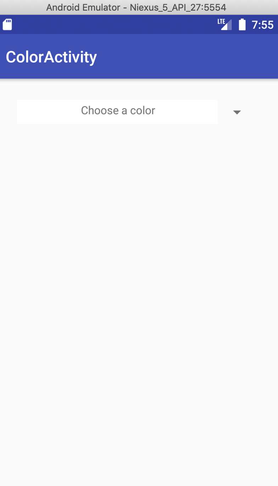
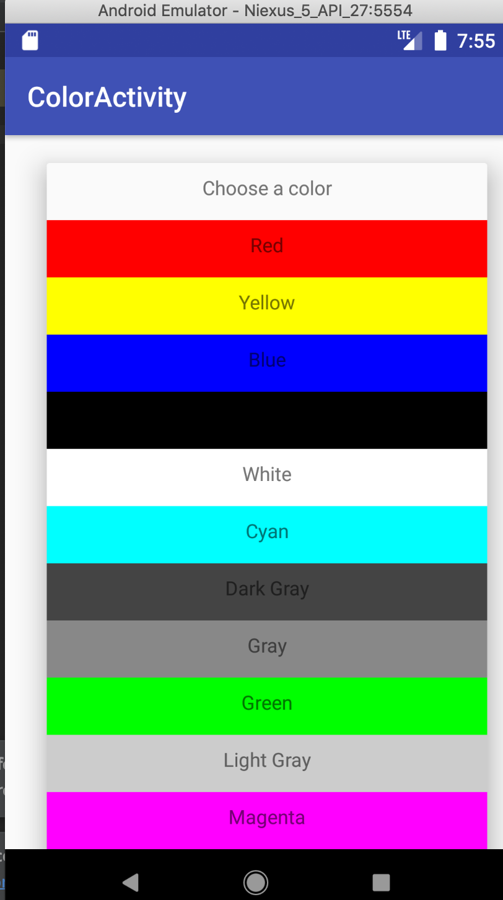
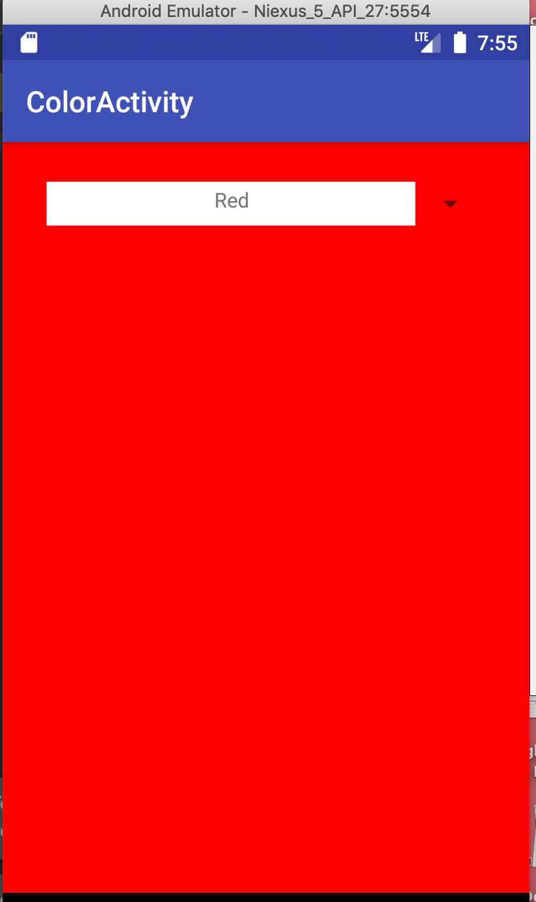

# Color_Picker_Lab4
Repo for color picker lab 4

This application uses custom adapter. It will alow the user to select a color from a spinner and once selected, sets the background color to the selected color.

When the user is in the drop-down mode, each text view's background color is the same as its displayed text value
When an item is selected, the view's background color is set to white.

When the user selects a color from the Adapter View, the activity's layout background is set to the selected color. 
The list of colors are predetermined there are 11 colors in total. 
There colors you will see are: 
Red, Yellow, Blue, Black, White, Cyan, Darkgray, Gray, Green, Lightgray, Magenta

Below is a screet shot of how the app looks like.

